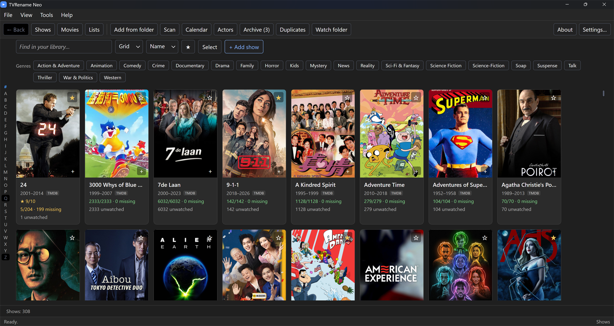
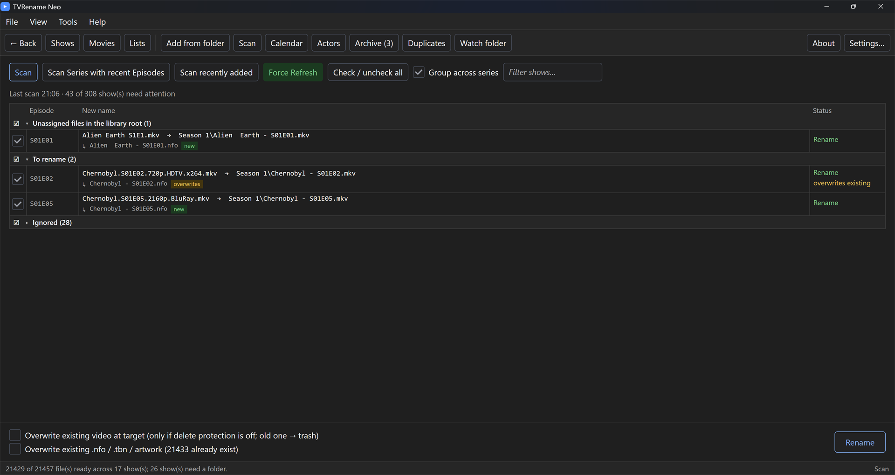
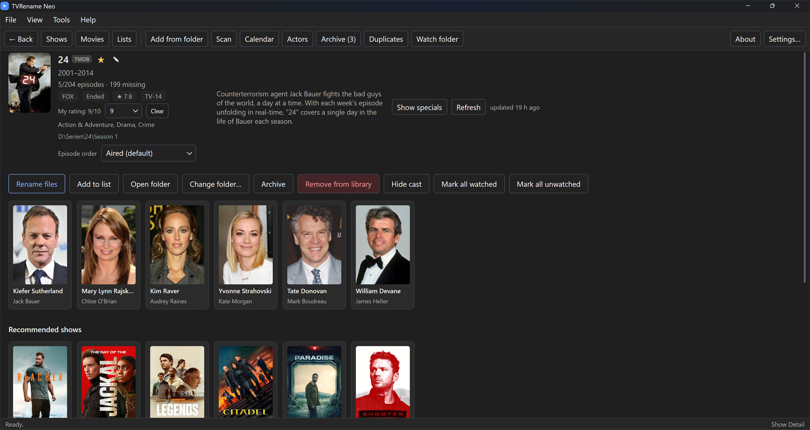

# TVRename Neo

A modern rework of [TVRename](https://github.com/TV-Rename/tvrename) — rebuilt from scratch on **.NET 10** with a clean, UI-independent core and an [Avalonia](https://avaloniaui.net/) desktop UI. **Windows only** for now (see [Platform](#platform)).

Point it at your TV episodes and movies and it renames them into a tidy, media-server-friendly layout, writing **Kodi-format** sidecar metadata that **Kodi**, **Jellyfin**, and **Emby** read directly.

> ### ⚠️ Alpha
>
> This is **alpha software under active development**. It works and it is used daily on a real library,
> but it has had exactly one user so far, so expect rough edges, and expect things to move:
>
> - **Back up your library before pointing it at files you care about.** The app is deliberately careful
>   (see [Safety & recovery](#safety--recovery)) — it previews every change, keeps deletes recoverable in
>   its own trash, and can undo an applied batch — but "careful" is not the same as "battle-tested".
> - **Try it on a copy of a folder first.** Every rename is previewed and nothing happens until you press
>   **Rename** — but when you do, it moves real files.
> - **Stored data may change shape between versions.** There is no upgrade guarantee yet.
> - **Windows only.** There are no Linux or macOS builds (see [Platform](#platform)).

## Screenshots

<!-- Captures live in docs/screenshots/ — see the README there before replacing them, especially the note
     about what must not be visible (paths containing a user name, an API key in Settings). -->

| My Shows | Rename preview |
| --- | --- |
|  |  |

| Show detail |
| --- |
|  |

## Contents

- [Features](#features)
  - [Rename engine](#rename-engine-core)
  - [Metadata & episode ordering](#metadata--episode-ordering)
  - [Movies](#movies)
  - [Library & browsing](#library--browsing--my-shows)
  - [Automation](#automation)
  - [Safety & recovery](#safety--recovery)
  - [Look & feel](#look--feel)
- [Screenshots](#screenshots)
- [Requirements](#requirements)
- [Desktop app](#desktop-app)
  - [Platform](#platform)
  - [Naming templates](#naming-templates)
  - [Custom episode ordering](#custom-episode-ordering)
  - [Watch folders](#watch-folders)
  - [Where your data lives](#where-your-data-lives)
- [Project layout](#project-layout)
- [Building & testing](#building--testing)
- [License](#license)

## Features

### Rename engine (core)
- Scans a folder (recursively) for video files. The recognised extensions are `.mkv`, `.mp4`, `.avi`, `.m4v`, `.mov`, `.wmv`, `.ts` by default, and are user-editable.
- Parses the series plus season/episode from each filename. The built-in patterns match `SxxExx`, `1x03`, `Se01Ep03`, `Season 1 Episode 3`, compact `203`/`1004`, and a bare episode number inside a `Season N` folder. The pattern list (regexes) is user-editable.
- Renames into a configurable layout — by default `The Newsroom/Season 1/The Newsroom - S01E03.ext`, i.e. a season folder inside the show's own folder (season 0 goes to `Specials`) — and writes sidecar files: `.nfo` (Kodi `episodedetails` XML), a `.tbn` thumbnail, and series artwork (`poster.jpg`, `banner.jpg`, `folder.jpg`). Each sidecar type can be turned off.
- Configurable season-folder and filename templates (see [Naming templates](#naming-templates)) plus filename character-replacement rules (e.g. `ä=ae`).
- A preview always shows the exact `old → new` for every file before anything is changed.

### Metadata & episode ordering
- Looks up metadata through a swappable `IMetadataProvider` interface: **TMDB** (the default), **TheTVDB** and **TVmaze**, with ratings from **OMDb** and **What's on?**. The active source is chosen in Settings / on the Search screen and is part of each item's identity, so it is picked per show and per movie. All three serve shows; movies come from TMDB or TheTVDB.
- **No API key needed to get started.** Release builds ship with application keys for TMDB and TheTVDB, and TVmaze and What's on? never needed one. You can still enter **your own key** for TMDB, TheTVDB (plus a subscriber PIN if your key uses its user-supported model) or OMDb — a key you enter always wins over the shipped one. OMDb ratings are the one source that needs your own key.
- **Alternative episode orderings** per show:
  - **Aired** order (the default),
  - a **provider episode group** such as TMDB's "DVD Order",
  - or a **custom order you build yourself** — reorder episodes, renumber seasons, and add provider-less episodes (with your own title/air date/plot) for shows like Mythbusters or American Dad where no standard order fits. See [Custom episode ordering](#custom-episode-ordering).

  The chosen order drives both the metadata lookup and the numbers written into the file names.
- **Language & region aware:** a region (e.g. `DE`, or automatic from the UI language) decides which age-rating certification is shown and which language the providers are queried in. File names stay in the default language unless you explicitly opt in (so turning language on never renames files behind your back).
- **Robust against outages:** a provider being unreachable is reported as such instead of being silently read as "episode not found". Per-source rate limiting plus `429`/`Retry-After` handling protect your API quota, and every network call has its own timeout.
- **On-disk metadata cache** with configurable freshness: stable series data, ended series, and still-airing series each have their own time-to-live. An **offline mode** serves everything from cache and never touches the network.

### Movies

Movies live in the same library as the shows, with their own screen and the same machinery behind them.

- **Add a movie** from a search or from an existing folder; every screen that renames episodes renames movies too, and one **Scan** covers both.
- Renames into a **folder per movie** — by default `The Thing (1982)/The Thing (1982).ext` — with its own `.nfo` and artwork.
- **Multi-part films, editions and extras** follow the Jellyfin conventions: `… - part1` / `… - part2` for a split film, `… - Director's Cut` for an edition, and recognised extras (trailers, featurettes) are left alone rather than mistaken for the film. A missing part is flagged.
- **Movie detail** with poster, cast, ratings, genres and your own 1–10 score; archive, remove or relink a single movie, and assign a folder to one that has none yet.
- The **Duplicates** finder groups movies by edition and part, so two copies of the same cut are a duplicate but a Director's Cut beside the theatrical release is not.

### Library & browsing — *My Shows*
- A library with **grid / list / banner** views, text and genre filters, sorting, favourites, archiving, and per-episode **have / missing / watched** status.
- **Add from folder** takes existing shows and movies into the library; **add from a search** adds one with no files yet — shows can come from TMDB, TheTVDB or TVmaze, movies from TMDB or TheTVDB.
- **Show detail** with poster, cast, ratings (the provider's ★ plus your own private 1–10), air-date span, content rating, per-season episode lists, and media info (resolution/codec) for the files you already have.
- Library-wide extras: a **Calendar** of upcoming air dates, an **Actors** browser (everyone across your library), **Statistics**, and a **Duplicates** finder.

### Automation
- **Watch folders:** point the app at your download folders and it notices new episodes and movies as they arrive — either listing them for review or (optionally) filing them into the library automatically. See [Watch folders](#watch-folders).
- **Scan:** check the whole library in one pass and collect every pending rename across all shows and movies into one preview. Narrower scans are available too — only recently added items, or only shows with episodes that aired in the last four weeks. A scan changes nothing on disk; you tick the rows you want and apply them separately.
- **Scheduled backups:** an automatic library backup, no more often than a configurable interval, made quietly at startup.

### Safety & recovery
- **Delete protection** (on by default) never lets a rename overwrite or destroy a *different* existing video — it only renames in place. A case-only rename of the same file stays allowed.
- **Move protection** (opt-in) additionally forbids moving a file into a `Season N` subfolder or anywhere else — rename strictly in place.
- Without overwrite, existing `.nfo`, `.tbn`, and artwork are **kept**, never silently replaced; a separate option protects hand-edited companion files even when overwrite is on.
- Deletes go to a **recoverable trash** (never a permanent delete), with a retention window and a restore window; whole rename runs can be **undone** from the rename history.
- Cross-volume moves copy-then-verify before removing the source; a failed sidecar/artwork step never undoes a completed rename.
- Paths from persisted indexes/logs are re-validated before any destructive operation, and API keys are stored **encrypted** on your machine (Windows DPAPI), never in plaintext. Library **backup / export / import** is built in.

### Look & feel
- **Themes:** four styles — Modern, Classic (modern chrome, classic controls), Classic full (classic menu/toolbar/table layout) and Classic + Actipro (the classic layout on Actipro's control theme) — each in **Light / Dark / Auto** (Auto follows the OS). Default is Classic + Actipro, Dark.
- **Localisation:** English and German UI, selectable in Settings (applied on restart).

## Requirements

Windows, and nothing else — a release build is a ready-to-run executable and ships with keys for TMDB
and TheTVDB, so metadata works immediately. (The [.NET 10 SDK](https://dotnet.microsoft.com/download) is
needed only to build from source.)

Optional, in Settings:

- **your own TMDB key** (<https://www.themoviedb.org/settings/api>) or **TheTVDB key** — plus a subscriber PIN if your key uses TheTVDB's user-supported model. A key you enter takes precedence over the shipped one.
- an **OMDb key** (<https://www.omdbapi.com/apikey.aspx>) if you want OMDb ratings — this one has no shipped default.

> **Building it yourself?** A source build embeds no keys (they are gitignored, see
> `EmbeddedKeys.Local.cs.template`), so you need at least a TMDB key of your own — in Settings, or via
> the `TMDB_API_KEY` environment variable.

## Desktop app

Download the executable from the latest [release](../../releases) and run it — no install, no SDK.

To run from source instead:

```bash
dotnet run --project app/TVRenameNeo.App
```

Any API key you enter under **Settings…** is stored encrypted on this machine (Windows DPAPI), never in plaintext. If the `TMDB_API_KEY` environment variable is set, it is used as a fallback.

Typical workflow: **Add from folder** → confirm the detected series → **Add to library**. Then rename its files from the show's page (**Rename files**), or go to **Scan**, check the whole library at once, tick the rows you want and apply them.

### Platform

**Windows is the only supported platform** — it is what gets built, released and tested. Linux and macOS builds are not planned for now.

The stack itself (.NET 10 + Avalonia) is cross-platform and the app does start elsewhere, but two things are Windows-bound and untested off Windows:

- **Encrypted key storage** uses Windows DPAPI, so an API key can only be *persisted* on Windows. Elsewhere the key must come from the `TMDB_API_KEY` environment variable — the encrypted store degrades to "no key" rather than saving one. A portable secret store would slot in behind `ISecretStore`.
- **File identity** (used to recognise a file that was moved or renamed outside the app) relies on Windows file IDs.


### Naming templates

Two templates control where episodes land, and two more do the same for movies. The episode pair shares this token vocabulary:

| Token | Meaning |
|---|---|
| `{show}` | series name |
| `{season}` / `{season:00}` | season number, plain or zero-padded |
| `{episode}` / `{episode:00}` | episode number, plain or zero-padded |
| `{episodetitle}` | the episode's title |
| `{year}` | the episode's air year (blank if unknown) |

Defaults:

- **Season folder:** `Season {season}` — season 0 always uses a `Specials` folder.
- **File name:** `{show} - S{season:00}E{episode:00}`

Example with `{show} - S{season:00}E{episode:00} - {episodetitle}` → `The Newsroom - S01E03 - The 112th Congress.mkv`. Illegal filename characters are sanitised, and your character-replacement rules (e.g. `:=-`, `ä=ae`) are applied afterwards.

Movies get their own folder and file template, over the tokens `{title}`, `{year}` and `{originaltitle}`.
Both default to `{title} ({year})`, which is what produces `The Thing (1982)/The Thing (1982).mkv`. Part
and edition suffixes are appended by the app, not written into the template.

### Custom episode ordering

For a show whose files follow neither the aired nor a provider order, open its page, pick **Custom…** in the episode-order selector, then **Edit custom order**. In the editor you can:

- pick a season tab (or add a new season),
- reorder episodes by dragging the ⠿ handle, or with the up/down controls — the list position *is* the episode number, so reordering renumbers automatically,
- remove an episode (a provider episode returns to the "available" pool), and
- add either a **provider episode** from the available list, or a **custom episode** the provider doesn't have, giving it your own title, air date, and plot.

Saving stores the order and re-opens the show in it. From then on, every rename of that show follows your order; custom episodes are named from the metadata you entered, and provider episodes still pull their details from the provider.

### Watch folders

In **Settings → Watch folders**, add one or more download folders. With watching enabled, the app scans them at startup and then watches live for new video files. For each recognised episode it either:

- **lists it for review** (default), so you confirm before anything moves, or
- **auto-renames it** immediately (opt-in), filing it straight into the matching show's folder.

If a matched show has no folder yet, the app can create one under your default show folder (on by default).

Files that parse as a **movie** rather than an episode are collected separately, as their own set of
proposals — so a download folder holding both is handled in one pass. Movies always go to review;
auto-rename covers matched shows only.

### Where your data lives

Everything is local. Your own data lives under `%APPDATA%\TVRenameNeo\` as readable JSON:

- `settings.json` — every option from the Settings dialog
- `library.json` / `movies.json` — the shows and movies you added
- `watched.json`, `movie-watched.json`, `ratings.json`, `movie-ratings.json` — watched flags and your private 1–10 ratings
- `lists.json` — your lists, `ignored.json` — items hidden from the library, `newepisodes.json` — what the watch folders found
- `custom-orders/` — one file per show with a custom episode order
- `tmdb.secret` / `tvdb.secret` / `omdb.secret` / `tvdb-pin.secret` — your API keys, DPAPI-encrypted
- `Backups/` — one timestamped folder per library backup

Alongside them sit three files you never need to touch, left out of backups because they are either
rebuildable or operational state:

- `cache.db` — the metadata cache (plus the derived actor index)
- `images.db` — the downloaded poster and still bytes
- `state.db` — the rename history and the trash index

The trash's actual files are **not** in `%APPDATA%`: each one stays on the volume it came from, in a
`.TVRenameNeoTrash` folder at that volume's root, so a delete never has to cross drives.

## Project layout

```
src/TVRenameNeo.Core           # platform-independent engine (no UI dependency)
  Scanning/                    #   find video files
  Matching/                    #   parse series/movie + season/episode from filenames
  Metadata/                    #   IMetadataProvider + TMDB / TheTVDB / TVmaze
  Model/                       #   domain types, incl. the episode-order model
  Library/                     #   library-level types shared by shows and movies
  Media/                       #   media info (resolution/codec) for existing files
  Output/                      #   Kodi NFO writer + artwork downloader
  Planning/                    #   compute old->new, safe filesystem apply
  Pipeline/                    #   orchestration
  Security/                    #   key obfuscation helpers
app/TVRenameNeo.App            # Avalonia desktop UI (MVVM) on the same core
  ViewModels/  Views/          #   the screens
  Services/                    #   persistence, caches, image loading, backups
  Themes/  Assets/             #   the theme styles and their resources
  Localization/                #   the English and German string tables
tests/TVRenameNeo.Core.Tests   # xUnit tests for the core
app/TVRenameNeo.App.Tests      # xUnit tests for the app layer
```

## Building & testing

```bash
dotnet build
dotnet test
```

## License

Licensed under the **GNU General Public License v3.0** — see [LICENSE](LICENSE). This matches the licensing of the original TVRename.

## Credits

A from-scratch rework inspired by the original **TVRename**.

Metadata sources, each with the attribution they ask for:

- This product uses the **TMDB** API but is not endorsed or certified by TMDB. TV data and images are from [The Movie Database](https://www.themoviedb.org/).
- Metadata provided by [**TheTVDB**](https://thetvdb.com/). Please consider adding missing information or subscribing.
- Show data from [**TVmaze**](https://www.tvmaze.com/), licensed under [CC BY-SA](https://creativecommons.org/licenses/by-sa/4.0/).
- Ratings from [**OMDb**](https://www.omdbapi.com/) and [**What's on?**](https://github.com/pierrevano/whatson-api).

The desktop UI uses [**Actipro Avalonia Themes**](https://github.com/Actipro/Avalonia-Controls) (free tier) for one of its visual styles.
